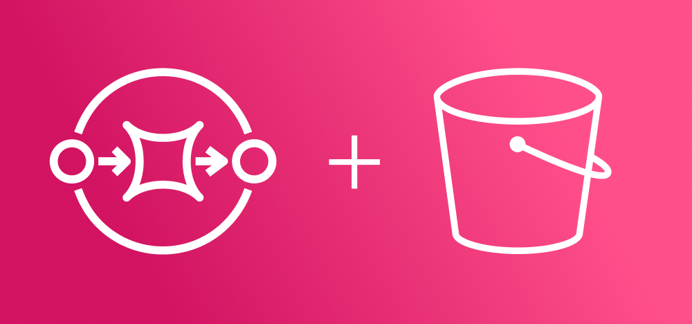

<div align="center">

<h1>sqs-extended-client-go</h1>
<i>Send and receive large messages through SQS via S3</i><br/><br/>
<a href="https://goreportcard.com/report/github.com/co-go/sqs-extended-client-go"></a> <a href="https://codecov.io/gh/co-go/sqs-extended-client-go"></a> <a href="https://pkg.go.dev/github.com/co-go/sqs-extended-client-go"></a>
</div>

****

`sqs-extended-client-go` is an extension to the Amazon SQS client that enables sending and receiving messages up to 2GB via Amazon S3. It is very similar to the [SQS Extended Client for Java](https://github.com/awslabs/amazon-sqs-java-extended-client-lib), but has an adjusted API to be more Gopher friendly.

The Extended Client also comes with a bit of extra functionality for dealing with SQS Events in Lambda. This all comes at no impact to the underlying Amazon SQS client- everything that is possible in the Amazon SQS Client, is possible in the Extended Client.

## Installation
```sh
go get -u github.com/co-go/sqs-extended-client-go
```

## Quick Start
```go
import (
	"context"
	"fmt"

	"github.com/aws/aws-sdk-go-v2/aws"
	"github.com/aws/aws-sdk-go-v2/config"
	"github.com/aws/aws-sdk-go-v2/service/s3"
	"github.com/aws/aws-sdk-go-v2/service/sqs"
	sqsextendedclient "github.com/co-go/sqs-extended-client-go"
)

const queueURL = "https://sqs.amazonaws.com/12345/testing-queue"

func main() {
	ctx := context.Background()

	// initialize AWS Config
	awsCfg, _ := config.LoadDefaultConfig(
		context.Background(),
		config.WithRegion("us-east-1"),
	)

	// create a new sqsextendedclient with some options
	sqsec, _ := sqsextendedclient.New(
		sqs.NewFromConfig(awsCfg),
		s3.NewFromConfig(awsCfg),
		// use "testing-bucket" for large messages
		sqsextendedclient.WithS3BucketName("testing-bucket"),
		// set the threshold to 1 KB
		sqsextendedclient.WithMessageSizeThreshold(1024),
	)

	// send a message to the queue
	sqsec.SendMessage(ctx, &sqs.SendMessageInput{
		MessageBody: aws.String("really interesting message!"),
		QueueUrl:    aws.String(queueURL),
	})

	// retrieve messages from the specified queue
	resp, _ := sqsec.ReceiveMessage(ctx, &sqs.ReceiveMessageInput{
		QueueUrl: aws.String(queueURL),
	})

	for _, m := range resp.Messages {
		// do some processing on each message...

		// delete message after processing. can also be
		// done more efficiently with 'DeleteMessageBatch'
		sqsec.DeleteMessage(ctx, &sqs.DeleteMessageInput{
			QueueUrl:      aws.String(queueURL),
			ReceiptHandle: m.ReceiptHandle,
		})
	}
}
```

## Working with Lambda
When using an [SQS queue as an event source for a Lambda function](https://docs.aws.amazon.com/lambda/latest/dg/with-sqs.html), the Lambda will be invoked on the configured interval with a batch of messages. Some of these messages might need to be fetched from S3 if they exceeded the limit of the queue and were sent with this (or another) SQS Extended Client. This is the use case for [`RetrieveLambdaEvent`](https://pkg.go.dev/github.com/co-go/sqs-extended-client-go#Client.RetrieveLambdaEvent). Very similar to [`RetrieveMessage`](https://pkg.go.dev/github.com/co-go/sqs-extended-client-go#Client.ReceiveMessage), it will parse any extended messages in the event and retrieve them from S3, returning a new event will the full payloads. If none of the events match the extended format, no action is taken!

### Example
```go
import (
	"context"
	"os"

	"github.com/aws/aws-lambda-go/events"
	"github.com/aws/aws-lambda-go/lambda"
	"github.com/aws/aws-sdk-go-v2/config"
	"github.com/aws/aws-sdk-go-v2/service/s3"
	"github.com/aws/aws-sdk-go-v2/service/sqs"
	sqsextendedclient "github.com/co-go/sqs-extended-client-go"
)

type Environment struct {
	queueURL string
	sqsec    *sqsextendedclient.Client
}

func (e *Environment) HandleRequest(
	ctx context.Context,
	evt events.SQSEvent
) error {
	parsedEvt, _ := e.sqsec.RetrieveLambdaEvent(ctx, &evt)

	for _, record := range parsedEvt.Records {
		// do some processing

		// delete message after processing. can also be done
		// more efficiently with 'DeleteMessageBatch'. see
		// note below about processing extended events.
		e.sqsec.DeleteMessage(ctx, &sqs.DeleteMessageInput{
			QueueUrl:      &e.queueURL,
			ReceiptHandle: &record.ReceiptHandle,
		})
	}

	return nil
}

func main() {
	// initialize AWS Config
	awsCfg, _ := config.LoadDefaultConfig(
		context.Background(),
		config.WithRegion("us-east-1"),
	)

	// create a new sqsextendedclient
	sqsec, _ := sqsextendedclient.New(
		sqs.NewFromConfig(awsCfg),
		s3.NewFromConfig(awsCfg),
	)

	// struct to share initialized client across invocations
	e := Environment{
		queueURL: os.Getenv("QUEUE_URL"),
		sqsec:    sqsec,
	}

	lambda.Start(e.HandleRequest)
}
```

> [!NOTE]
> #### If you plan on processing extended events within a Lambda function
>
> When processing SQS events in a Lambda function, if the invocation doesn’t return an error (indicating success), AWS will delete the SQS messages from the queue to prevent re-processing. This is a good thing! However, due to the special way extended messages are deleted, if AWS deletes an extended message that has a linked payload in S3, **AWS will NOT delete the S3 payload**.
>
> There are multiple different ways to solve this (S3 lifecycle policies, etc.), but the recommended way to ensure the entire message is always cleaned up after processing is to explicitly call the DeleteMessage (or DeleteMessageBatch) functions.